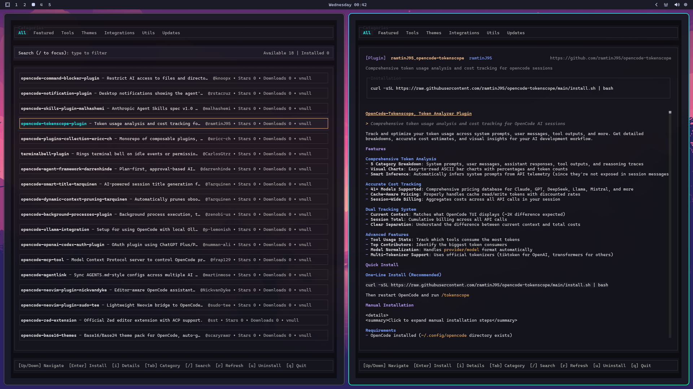

# OpenCode Extensions TUI

**A beautiful terminal interface for discovering and managing OpenCode extensions**

  

> **⚠️ Important Disclaimer**: This is currently a **UI demo** showcasing a plugin browser interface for OpenCode extensions. It does not include actual plugin installation, management, or the automated community pipeline for adding and reviewing extensions - these features are planned for future releases.



## What is this?

OpenCode Extensions TUI is a fast, keyboard-driven terminal application that lets you browse, search, and manage OpenCode extensions right from your command line. No browser needed!

Perfect for developers who live in the terminal and want to quickly discover new tools and extensions for their OpenCode setup.

## Key Features

- **Lightning Fast** - Instant search and navigation
- **Beautiful Interface** - Clean, responsive terminal UI
- **Smart Search** - Find extensions by name, description, or category
- **Organized Browsing** - Navigate through curated categories
- **Keyboard Only** - Full control without touching your mouse
- **Rich Information** - See downloads, stars, and detailed descriptions
- **Live Updates** - Refresh to get the latest extension data
- **Installation Tracking** - Mark extensions as installed/uninstalled (UI simulation)

## Quick Start

### Prerequisites

You need [Bun](https://bun.sh/) installed (it's like npm but way faster):

```bash
curl -fsSL https://bun.sh/install | bash
```

### Installation & Running

```bash
# Clone the repository
git clone https://github.com/IgorWarzocha/Opencode-Extensions-TUI.git
cd Opencode-Extensions-TUI

# Install dependencies (takes ~10 seconds)
bun install

# Launch the TUI!
bun dev
```

That's it! You're now browsing extensions in your terminal.

## How to Use

### Navigation

| Key | What it does |
|-----|--------------|
| `↑` `↓` or `w` `s` | Move up/down through extensions |
| `←` `→` or `a` `d` or `j` `k` | Switch between categories |
| `Tab` | Quick category cycling |
| `Enter` | Mark extension as installed |
| `u` | Uninstall selected extension |
| `i` | Show detailed information |
| `/` | Start searching |
| `r` | Refresh extension data |
| `q` | Quit the application |

### Search Mode

Press `/` to search:
- Start typing to filter extensions instantly
- `Enter` to apply search
- `Escape` to cancel and go back

### Views

1. **List View** - Browse all extensions with key info
2. **Details View** - Press `i` for full extension details
3. **Search View** - Press `/` to find specific extensions

## What You'll See

Each extension card shows:
- **Name & Author** - Who made it
- **Stars & Downloads** - Community popularity
- **Category** - What type of extension it is
- **Description** - What it does
- **Status** - Available or marked as installed

**Note**: Extension data is loaded from local JSON files in the repository, not from a live API.

## For Developers

Want to contribute or modify the TUI?

```bash
# Development with hot reload
bun dev

# Run directly
bun run src/index.tsx
```

Built with React 19, OpenTUI, and TypeScript. See [AGENTS.md](./AGENTS.md) for development guidelines.

## Contributing

Found a bug or have an idea? 

1. Open an [Issue](https://github.com/IgorWarzocha/Opencode-Extensions-TUI/issues)
2. Fork and create a Pull Request
3. Join the OpenCode community!

## More About OpenCode

- [OpenCode Official Site](https://opencode.ai/)
- [OpenCode GitHub](https://github.com/sst/opencode)
- [OpenCode Documentation](https://opencode.ai/docs/)
- [GitHub Discussions](https://github.com/sst/opencode/discussions)

---

Made for the terminal-loving developer community

If you like this, give it a star on GitHub!
